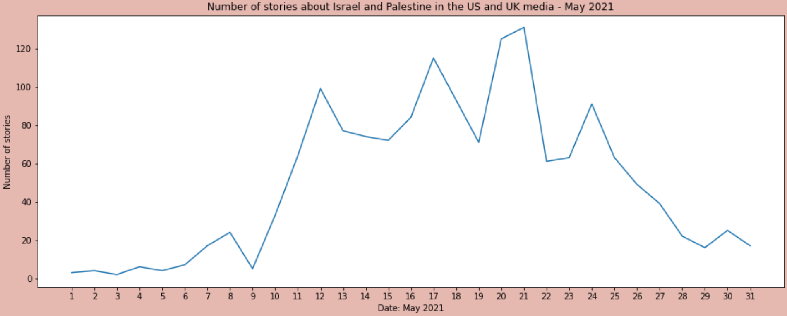
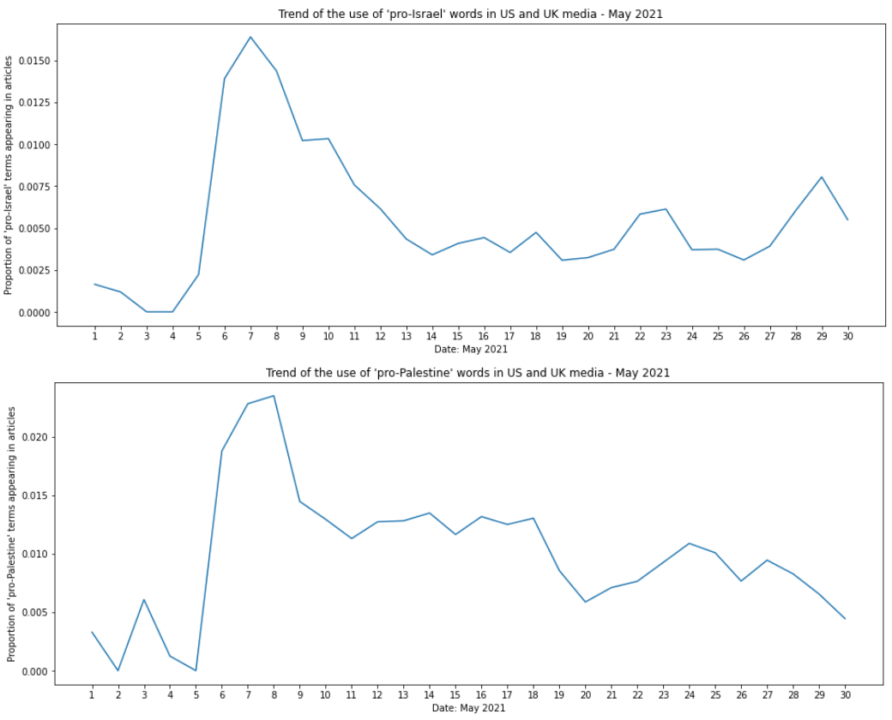
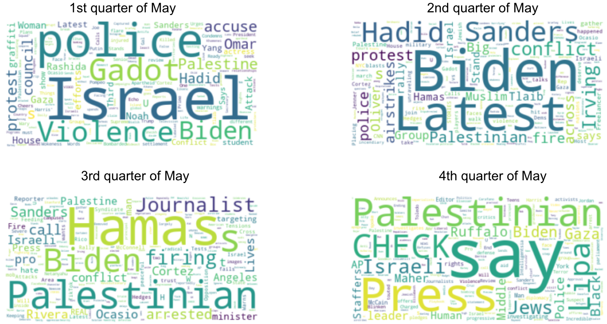
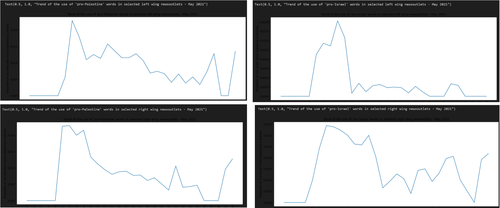
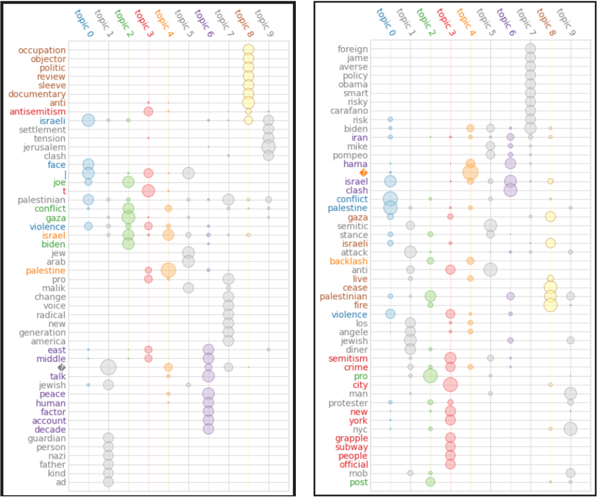

# Framing the Israel-Palestine Conflict- A critical Analysis of Western media coverage in May 2021
# INTRODUCTION
When in May 2021 there was yet another war-like outburst in the long history of the Israel-Palestine conflict it did not take long until thorough Western media coverage took of. However, with increasing media attention there was also rising criticism of the manner of coverage - especially the choice of words when describing the conflict. This criticism, largely voiced on social media and later institutionalised through various non-western aligned news outlets consistently remarked the choice of using ‘neutral’ terms when covering the conflict (such as ‘clash’, ‘property dispute’) as well as a skewed attention to palestinian aggressors (‘terrorists’) over Israeli violence (‘police operation’). This increasingly voiced contradicting narrative quickly became a substantive part of the online discourse on the topic, contradicting the dominant perspective on the events. 
This research analyses the effects of the public sphere’s assessment of the media coverage through text analysis. To do so, it will first refresh the reader’s memory of the timeline of May 2021, before briefly introducing the theory of framing. Then, the paper will depict the widely spread criticism of Western media framing the new escalation of conflict in Israel Palestine, before quickly diving into the idea of public spheres and the influence of alternative media on mainstream discourse. 
Having laid the ground for the actual research, the paper will adress the: 
- research question
- methodology
- justifications (time period, choice of sources)
- limitations
- Analysis
- Findings
Then, the paper will proceed to conclusion and discussion on further analysis.

# TIMELINE OF THE CONFLICT

The newest hot period of the now 70 years long Israel-Palestine conflict built up in April and early May 2021 due to the planned eviction of Palestinian families from the Sheikh Jarrah neighbourhood, a part of East Jerusalem with a history of conflict since the 50s between the residing Palestinian population and Israelian settlers (El-Haroun, 2021). At the beginning of May, a series of escalations between Palestinian (violent) demonstrators and Israelian armed forces took place, resulting in several dead. The conflict intensified over the end of Ramadan, the holy month for Muslims, when the Israelian military and police surrounded the Al-Aqsa mosque on May 7th, provoking violent demonstrations on the side of Palestinians answered by the use of water cannons and stun grenades (Farrell, S.; Lubell, M., 2021). The conflict escalated into a military conflict on May 10th when Israeli police stormed a building of Palestinian worshippers, planning to raid it. This raid, coinciding with the yearly celebration of the Israeli occupation of Jerusalem led to Hamas firing rockets at Israeli territory, provoking airstrikes from the Israeli side to Gaza (the Guardian, 2021). With protests in Muslim dominated cities, Israel declared an emergency state over these cities, leading to an intensification of violence and continued bombing of Palestinian territory, as well as counter bombing aimed at Israeli territory. The bombing continued, with Israel destroying a residential tower in Gaza on May 11th, claiming Hamas had used this building for planning attacks, answered by over 100 missiles sent by the Hamas to Israel (Reuters, 2021). The sending of missiles, arrests of Palestinians and raids on Israeli territory as well as intense violence continued until May 20th when a ceasefire was negotiated (Tal, A., 2021). Although this agreement does not lead to the suspension of violence overall, it stops the sending of heavy attilery on both sides. 

# NEUTRAL ON THE OUTSIDE, BIASED ON THE INSIDE? POPULAR CRITICISM OF WESTERN MEDIA COVERAGE AND ITS IMPACT ON PUBLIC DISCOURSE

This research paper will critically examine the media coverage of the conflict. For this, the paper will first briefly introduce the reader to the idea of framing in media, then look into widespread criticism of Western media coverage, before diving into the discussion of public spheres and their influence on mainstream media outlets. 

## Framing as an integral aspect of text

Framing is a body of theory widely used in media studies generally and journalism specifically, referring to the way of projecting certain events in a certain manner, usually, through using images, words or contexts: “to frame is to select some aspects of a perceived reality and make them more salient in a communicating text, in such a way as to propose a particular problem definition, causal interpretation, moral evaluation, and/or treatment recommendation for the item described” (emphasis not added, Entman, 52). Framing, therefore, happens with the goal to portray a given issue in a certain light, but it does not mean that facts are necessarily changed, it rather concerns the vocabulary that is used to express a certain situation. It is important to note that writing a text without using frames is not possible, as the portrayed issue in the text is always represented in some way. Also, neutral, objective scientific terms are putting a described issue into a certain perspective. Framing, therefore, does not have to be intentionally manipulative, it is rather very much the way the issue at stake is expressed. It would go beyond this research to go into a full literature review on academic theories of framing, therefore the paper will exclusively look at how theory applies to the present case. 

## Criticism of Western ‘neutral’ frames 

When tensions rose and the conflict started escalating into a new hot phase, Western media did not take long to pick up on the conflict and elaborately report on it. 

Coverage of Israel and Palestine through May

Starting first of May, English language media outlets started publishing extensively on the issue, bringing the conflict once again into the centre of media attention and public discourse. The manner of media coverage, however, was soon criticised as depicting reality in a distorted way, backing up the Israeli perspective and leading to anti-Palestinian sentiments. The deliberate use of “objective” terms in Western media coverage was criticised as favouring and supporting the Israeli narrative against the Palestinian reality. What was first criticised by social media users, was soon picked up by The problem with neutral terms is that it assumes equality between the ‘conflict groups’ and a sense of mutuality in the conflict (O'Toole, M., 2021). Specifically words such as ‘clashes’, or ‘property/territory dispute’ imply that there is “a degree of equality in the use of violence and that both sides are equally to blame” (MacDonald, A., 2021). Moreover, these terms are passive, removing agency from the conflict, which ultimately leads to “blame […] be spread evenly among those involved” (MacDonald, A.). The use of terms such as property or territorial disputes goes as far as removing the cultural and deep-rooted origins of the conflict, diminishing it to its legal core, e.g. the practice of Israel placing settlers in Palestinian territory and the dispute over this illegal practice. This, however, ignores the structural discrimination and continued harassment that Palestinians have to endure under the Israeli state (MacDonald, A.). Moreover, according to criticism, such terms suggest that these disputes are disputes over “contest grounds”, something that goes against UN decisions that these ‘contest territories’ are lawfully Palestinian territory (O'Toole, M.). Moreover, there is an alleged bias about what is reported and how reporting is followed up: much attention is given to Palestinian aggressors (“terrorists”), but little to Israeli violence (“police operations”) (O'Toole, M.)

This list of ‘neutral’ keywords is not exhaustive but offers an insight to the structure of the critics’ arguments. According to such criticism, the framing of the events of May 2021 appeared neutral, disguising the actual power structures at play, hence favouring the Israeli oppressor and legitimating its actions. Moreover, through distorted media coverage, western attention is disproportionally directed toward Palestinian violence against Israelis, while Israeli violence against Palestinians remains unseen. Overall, the framing of the May 2021 violence is alleged to be pro-Israeli in disguise, making it hard for uneducated readers to truly understand what is going on which contributes to the further marginalisation of Palestine. 

## Public spheres 

What can be observed here is that persistently voiced criticism of social media users, specifically Twitter users got institutionalised and expressed in the institutionalised framework of alternative media. [Twitter](https://twitter.com/nytimes/status/1391788220589936640), and the alternative media outlets can be understood as ‘public spheres’ where opposing views can be voiced (Kaiser et.al, 424). Through the network organisation of users who are aware of the violence committed in Israel and Palestine, it was possible to build up a thorough ‘response mechanism’ to every publication on Twitter, contradicting the established ‘neutral’ narrative. As posts regarding the conflict became more frequent, the average Twitter user the number of contradicting criticism rose accordingly - building up a united front against the common perspective on the conflict. As mentioned in Kaiser et.al.’s paper, research has shown that such united public spheres have the potential to influence politics and public discourse, as expressed by mainstream media outlets (ibid). Especially when supported by ‘alternative media outlets’ (general understood as media that expresses the view of (discourse) minorities) (ibid, 425) the discourse brought forward in the public sphere is able to challenge the narrative of mainstream media (ibid, 424).

# RESEARCH QUESTION AND METHODOLOGY
This research will exclusively focus on the framing of media attention to the conflict period, aiming to observe the impact of the issued criticism. The research will not look into the bias of reported events itself (e.g., whether Palestinian aggressors are more prominent in media coverage than Isralian aggressors) as it would go beyond the scope of text analysis research. Rather the research will look into the frames of media coverage; examining two aspects of the media coverage. 
Whether we can confirm the criticism’s observation of neutral framed coverage in favour of the Israelian narrative
Whether we can see a change in the frames as a reaction of such critique
With emphasis on the second question. 

# DATA
Our empirical analysis of the described issue is based on data obtained from the MediaCloud API. MediaCloud is an online platform monitoring world media, and providing - among other details - article titles based on selected specifications. In this analysis we obtained our data using the keywords “israel” and “palestine” in the query sent to the API, requesting articles published in the US or the UK between 1 May and 31 May 2021.

# METHODOLOGY
The methodology used in this analysis is threefold. Using methods of automated text analysis, we qualitatively explore the shift in the use of words reporting on the events unfolding between Israel and Palestine in May 2021.
First, relying on previous literature on the topic, we select two sets of words, one set referring to a “pro-Israel” and the other set referring to a “pro-Palestine” style of reporting. We then count the number of such words appearing in the collected text corpus (article titles published in the US or the UK in May 2021 using the words Israel and Palestine in their article body) to qualitatively identify the presence or absence of a shift between the two modes of biassed reporting. We find that through the course of May, both “pro-Israel” and “pro-Palestine” word-use decreased, indicating a potential shift towards more neutral language.
To explore the problem further, we continue our qualitative analysis by dividing the observation period into four distinct subperiods, each referring to one quarter of May, and obtain word clouds for each of these quarters for an insight into the most typical words characterising the quarters.  We find that different words appear to dominate in each quarter, suggesting on the one hand changes in the nature of events that are reported on, on the other hand also potentially the changes in the way of reporting.
Finally, we used topic modelling to observe the topics talked about in the US and UK media during May from yet another angle. Here we found a number of distinct topics, which might be helpful in the interpretation of the association between words found in the second step.

# ANALYSIS
Western media attention strongly coincides with the intensity of the events on the ground - strongly increasing around the 10th of May and peaking around the conclusion of the ceasefire, with a strong decline of attention afterwards. The corpus of text was then examined for the two ‘camps’ of words employed, as claimed by critiques. The words searched for are: 

‘Pro-Israel’:
- (self) defence
- Border conflict
- Provocation/ clashes/(property) dispute
- (Gaza) militants vs (Israeli) police
- Extremists, terrorists

‘Pro-Palestine’:
- extreme violence
- Shootings
- Civilians casualties
- Apartheid/structural discrimination
- Occupation
- settlers

The identified “neutral/pro-israeli” words are most frequent between the 5th and 11th of May before they decline and stay at a stable level for the rest of the month. Curiously pro-palestinian words follow a very similar trend - although not as developed, there is also a peak visible in the first third of the month, with lower shares of proportion for the remaining month ( but at less stable daily levels).

The word clouds offer a little more insight into the ongoing discourse, by displaying the most frequently used words per quarter of the month. The first quarter seems to coincide with the observations of critiques - with ‘Israel’ and ‘police’ being the most frequently appearing words. What is interesting, is that other frequently appearing words are names, such as Biden, Gadot and Hadid. In the second quarter, the focus on prominent persons again dominates the headlines of English speaking media, with some of the most frequent words being ‘Biden’, ‘Sanders’ and ‘Hadid’ again. While Biden as US president naturally appears in a global crisis, the names of Bernie Sanders and Bella Hadid were most likely at the centre of media attention because of their pro-Palestinian statements (Sanders, 2021; Respers France, 2021), which were harshly criticised at that time as anti-Israeli (in the case of Sanders, who himself is jewish) or straight anti-semitist (in the case of Hadid). The dominance of their names in headlines connected to the criticism on their pro-Palestinian statements shows both that the media discourse was distorted by events in the West, as well as that public favour was still with Israel. The last two quarters are rather hard to interpret. The fact that the word ‘Palestinian’ was more dominant than ‘Israeli’ can mean that there was more focus on the events happening in Palestine, but can also reflect that there was simply more destruction going on in Palestine than in Israel. 
To shed light on the words in the word clouds and their context, topic modelling is applied to the corpus of data. Due to the limitation of only having headlines in the corpus, the usage of topic modelling is limited. Nevertheless, it shows that emotional words, such as ‘hate’ are used in the context of (Western) antisemitism (topic 3), while the Israeli-Palestinian conflict is connected to the neutral word ‘tension’ rather than more impactful words such as ‘discrimination’ (topic 2).
To further refine the analysis it is interesting to look into how newspapers of different political camps were reporting about the conflict and were influenced by readers and critics. For this, the research picked 3 representative news outlets from each right-winged and left-winged bias. For the selection, both the political bias, but also the popularity of the newspaper was used. To identify the political bias, the website media bias/fact check was used. It is important to note that all these newspapers are mainstream media, therefore their political bias might be moderate, compared to what some ‘alternative’ sources are offering. This was done deliberately - the sources should represent a certain market share. 
The six sources selected are: 

Left bias: 
- The Guardian
- CNN
- The Washington Post

Right bias: 
- Fox News
- The Telegraph
- Washington Times

Repeating the search employed before one can see a remarkable difference between right and left-winged media outputs in terms of word. Left-wing media outlets reacted to criticism more thoroughly and faster than right-wing media which continued 
It becomes clear that left-leaning media outlets adapted to voiced criticism much more thoroughly than right-leaning sources, diminishing the use of “neutral” words rather quickly and using more extreme words to describe the events. Right-leaning outlets, however, kept a high amount of ‘neutral’  terms . 

Looking at the topic modelling for these two corpora, another striking difference that can be observed is the focus of media attention. While left-leaning media primarily focuses on the events in Israel and Palestine, right-wing media’s attention is directed at events in the West (mainly America). topic 8 and 9 of left-wing headlines deal with ‘occupation’ and ‘settlement’ (mentioning as well the words ‘clash’ and ‘tension’ nevertheless). Right-leaning media, however, seems to discuss events related to American politics in the topics 1,3,5 and 7. Curiously anti-semitism seems to be a topic that right-leaning media discusses, although the present analysis does not suffice to conclude in what way this issue was discussed. 

# LIMITATIONS AND FURTHER ANALYSIS
Our analysis primarily explored the headlines of articles. We did this since headlines were significantly  easier to find compared to entire texts of articles, therefore enabling us to conduct this project. To take this analysis to a further step, however, exploring the corpus of articles should be considered. Full text articles will likely reveal the tone of the article even more, hence it will provide us further insights. Data collection will be a challenge to do so, nonetheless this approach is worth a try. 
Looking into social media APIs will complement our research. First, it will reveal whether our assumption that there was a shift of the opinion from pro-Israeli to pro-palestinian in the public sphere was valid. This will reinforce our entire research credibility as the assumption will now be considered as an established fact. Secondly, there are various media outlets tweeting about the content of their articles. This is another approach that can be taken to study the stance of various media outlets, which is possibly easier than the approach described above. 
This project consisted on focusing on key words: observing the frequency of these key words mentioned in the articles, and creating word clouds. This has allowed us to extract various insights out of those. To complement our studies, it is also possible to conduct sentimental analysis. Sentimental analysis will judge the overall tone of the article by giving scores that reflect how “positive” or “negative” they are. To conduct this study, there are again possible approaches to be considered. 
One way is to use the Natural Language Toolkit (NLTK), which is a suite of libraries and programs allowing statistical natural language processing in Python. They have a function where they give scores to articles you have imported. 
Another approach is to use the machine learning function. Firstly, there has to be human intervention to annotate the sentiment of a certain number of articles, which will be studied by the algorithm. Once this step is completed, the machine learning process can study other articles, based on the annotated data. 
In order to conduct sentiment analysis, however, it is first necessary to divide the pool of the articles collected into pro-Israeli and pro-Palestinian ones. This is because solely calculating the scores of each article will not reveal the stance of them. This can become a challenge since the amount of articles to be classified is numerous. For the word cloud, it was interesting to see that there are observable trends showing how more neutral words are being used. However, the word cloud itself is not enough to fully determine if this is the case. For example, the use of the word Hamas- is it happening because the media is describing Hamas as representing a large body of Palestine? Or, to purely describe the situation, hence without an intention described above? The word clouds would not fully tell that.
In terms of the world clouds, it was interesting to observe how there was a transition of words being used. The world clouds themselves, however, are not enough to reveal in what ways those words are used. For example, during the second quarter, various names were mentioned who were showing pro-Palestinian stance. It is uncertain whether those articles are, hence, critical of them, or vice versa. Although the findings so far are interesting as it has been shown that those pro-Palestinian stance was under the spotligh, further exploration of the actual content of the articles are needed. 

# CONCLUSION

## Bibliography
El-Haroun, Z., 2021. Clashes in Jerusalem ahead of court case on Palestinians' eviction. [online] Reuters. Available at: 	<https://www.reuters.com/world/middle-east/clashes-jerusalem-ahead-court-case-palestinians-eviction-2021-05-05/> [Accessed 28 March 2022].

Entman, R., 1993. Framing: Toward Clarification of a Fractured Paradigm. Journal of Communication, 43(4), pp.51-58.

Farrell, S. and Lubell, M., 2021. Clashes, prayers in Jerusalem on Muslim Laylat al-Qadr. [online] Reuters. Available at: 	<https://www.reuters.com/world/middle-east/israel-boosts-security-forces-ahead-tense-night-jerusalem-2021-05-08/> [Accessed 28 March 2022].

Kaiser, J., Rauchfleisch, A. and Bourassa, N., 2019. Connecting the (Far-)Right Dots: A Topic Modeling and Hyperlink Analysis of (Far-)Right Media Coverage during the US Elections 2016. Digital Journalism, 8(3), pp.422-441. 

MacDonald, A., 2021. Israel-Palestine: A glossary of problematic media language. [online] Middle Eastern Eye. Available at: 	<https://www.middleeasteye.net/news/israel-palestine-aqsa-sheikh-jarrah-media-coverage-problematic-glossary>  [Accessed 28 March 2022].

O'Toole, M., 2021. How to bring more balance to western media coverage of Israel and Palestine. [online] Al Jazeera Media Institute. Available at: <https://institute.aljazeera.net/en/ajr/article/1484>   [Accessed 28 March 2022].

Reuters. 2021. Gaza residential tower collapses in Israeli airstrike, witnesses say. [online] Available at: <https://www.reuters.com/world/middle-east/gaza-residential-tower-collapses-israeli-airstrike-witnesses-say-2021-05-11/> [Accessed 28 March 2022].

Tal, A., 2021. Israel and Palestinian militant group Hamas agree to a ceasefire. [online] CNN. Available at: <https://edition.cnn.com/2021/05/20/middleeast/israel-palestinian-gaza-conflict-ceasefire-intl/index.html> [Accessed 28 March 2022].

the Guardian. 2021. Israeli police storm al-Aqsa mosque ahead of Jerusalem Day march. [online] Available at: 	<https://www.theguardian.com/world/2021/may/10/dozens-injured-in-clashes-over-israeli-settlements-ahead-of-jerusalem-day-march> [Accessed 28 March 2022].

